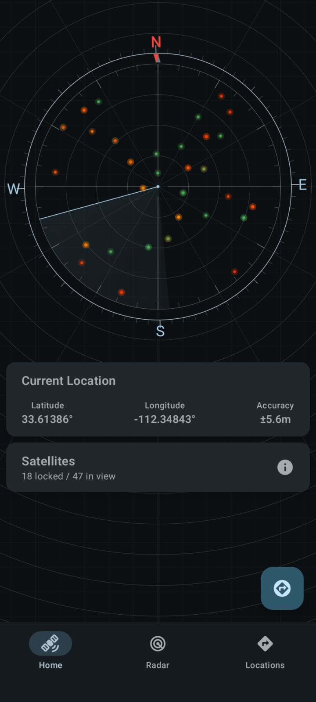
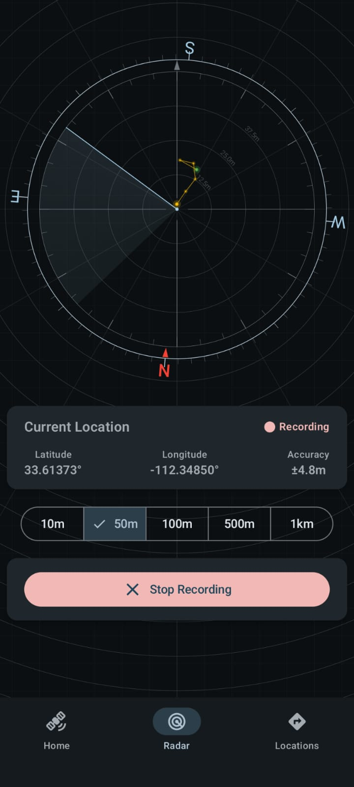
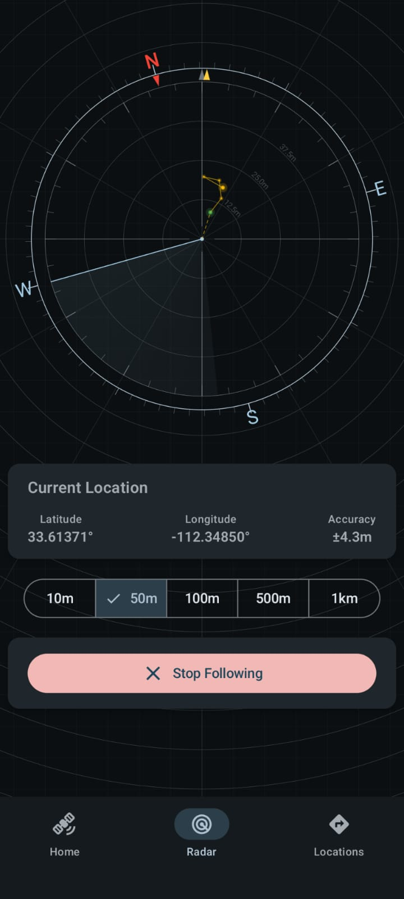
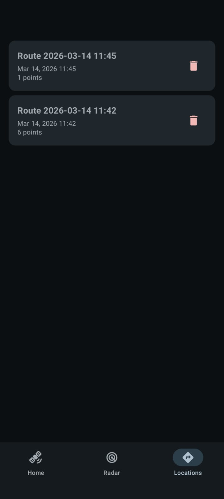

# Radar

Radar is an Android application for recording GPS points to create routes, saving them, and navigating back.
Designed for outdoor use where traditional navigation (Google/Apple Maps) is unavailable due to poor cellular reception.

## Features

- Route recording - capture GPS points as you move
- Route saving - store routes locally for later use
- Route following - navigate back along saved routes
- Compass heading - uses device accelerometer + magnetometer
- GPS satellite tracking - see satellite visibility
- Picture-in-Picture mode - keeps radar visible while multitasking
- Works fully offline - GPS only, no internet required

## Technical Details

- **Minimum SDK**: 35
- **Target SDK**: 36
- **Language**: Kotlin
- **Build System**: Gradle with Kotlin DSL
- **Architecture**: MVVM with Hilt dependency injection
- **UI Framework**: Jetpack Compose
- **Database**: Room
- **Location Services**: Google Play Services Location
- **Sensors**: Accelerometer + Magnetometer (compass heading)
- **Satellite Tracking**: GPS satellite visibility display

## Screenshots
<p float="left">
  
  
  
  
</p>

## Project Structure

```
Radar/
├── app/
│   ├── src/
│   │   ├── main/
│   │   │   ├── java/com.ameraldo.radar/     # Application code
│   │   │   ├── res/                         # Resources
│   │   │   └── AndroidManifest.xml          # App manifest
│   │   ├── test/                            # Unit tests
│   │   └── androidTest/                     # Instrumented tests
│   ├── build.gradle.kts                     # App module build config
│   └── proguard-rules.pro                   # ProGuard rules
├── build.gradle.kts                         # Project-level build config
├── settings.gradle.kts                      # Settings and repositories
├── gradle.properties                        # Gradle properties
└── README.md                                # This file
```

## Dependencies

Key libraries used in this project:

- **AndroidX Core KTX**: Kotlin extensions for Android framework
- **AndroidX Lifecycle**: Lifecycle-aware components
- **Jetpack Compose**: Modern UI toolkit
  - Compose BOM (Bill of Materials)
  - UI, Graphics, Tooling Preview
  - Material 3 and Material 3 Icons Extended
  - Foundation Layout
  - Adaptive Navigation Suite
- **Android Room**: Local persistence library
- **Google Play Services Location**: Location APIs
- **Hilt**: Dependency injection (via KSP)
- **Testing**: JUnit, Espresso, Compose UI Testing

## Setup

1. Clone the repository
2. Open in Android Studio (Chipmunk or later recommended)
3. Sync Gradle dependencies
4. Run on an emulator or physical device (API 35+ required)

## Permissions

The app requests the following permissions at runtime:
- `ACCESS_FINE_LOCATION`  
- `ACCESS_COARSE_LOCATION`  

These are required for the location-based features of the application.  
This app works entirely offline using only GPS - no internet or cellular connection required.  

## Building

To build the debug variant:
```bash
./gradlew assembleDebug
```

To build the release variant:
```bash
./gradlew assembleRelease
```

## Testing

Run unit tests:
```bash
./gradlew test
```

Run instrumented tests:
```bash
./gradlew connectedAndroidTest
```

## License

This project is licensed under the GPL License - see the LICENSE.md file for details