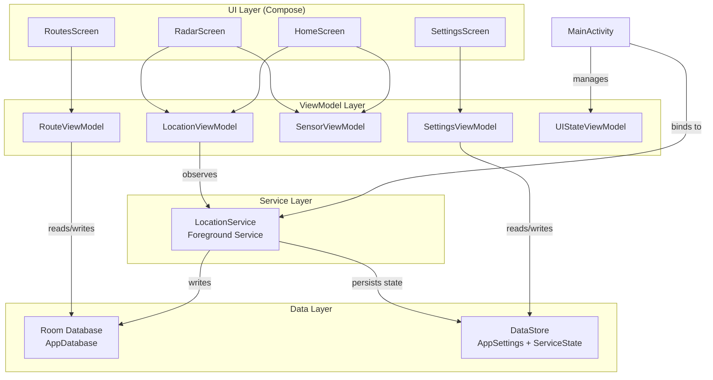
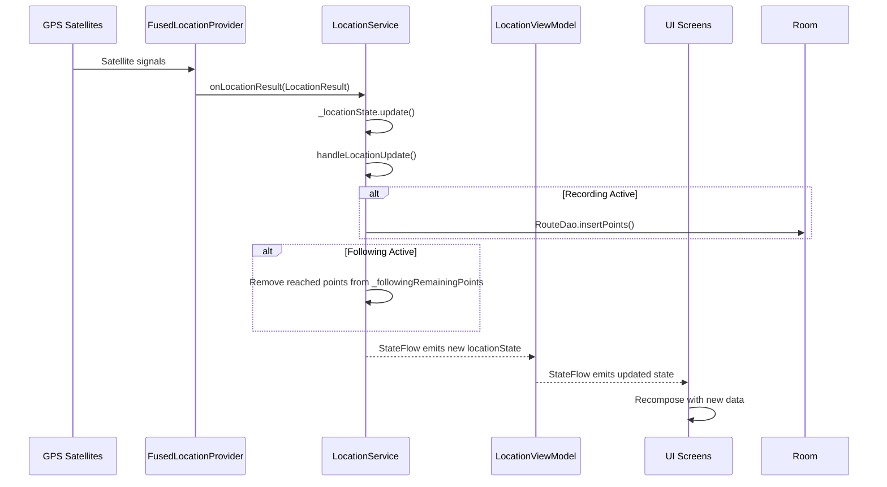
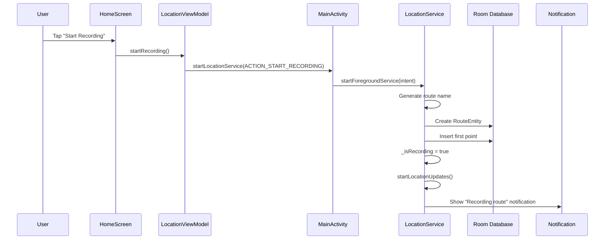
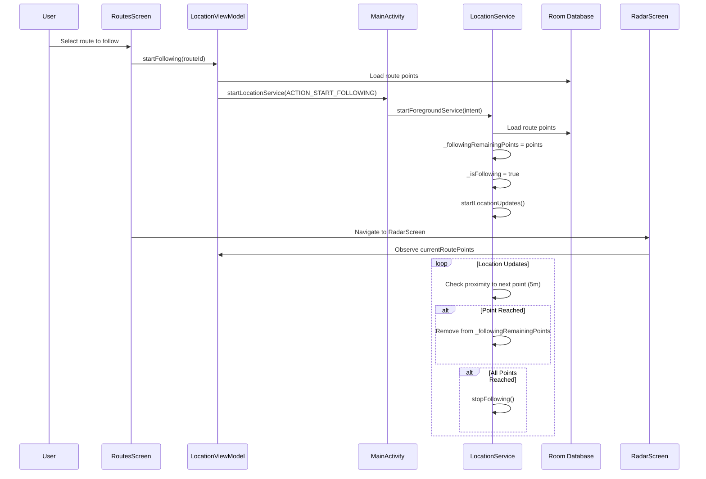
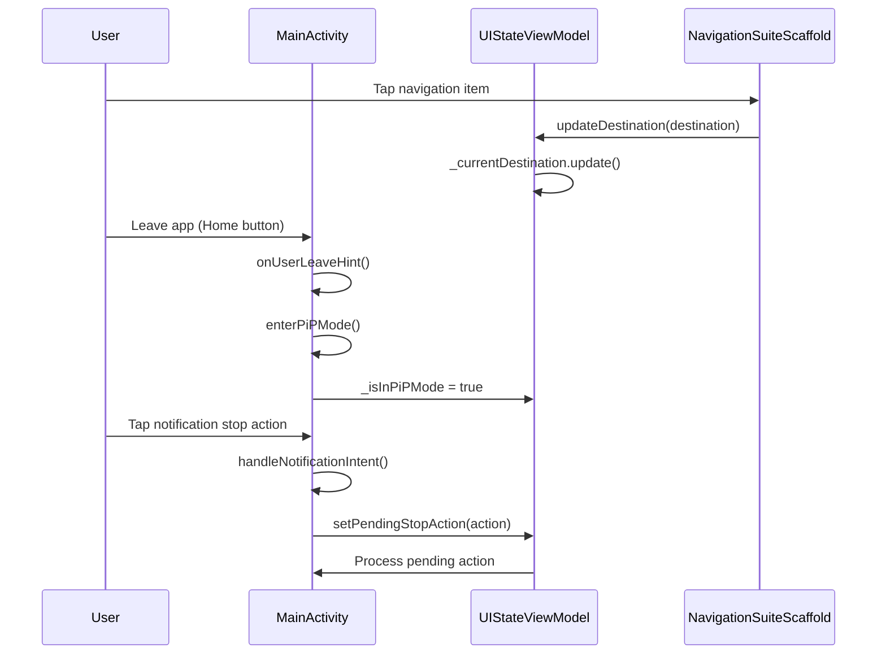
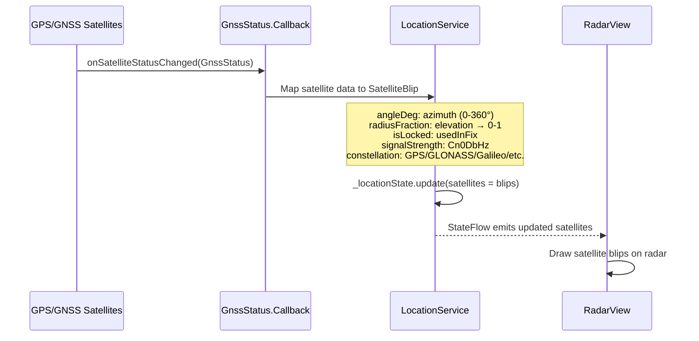
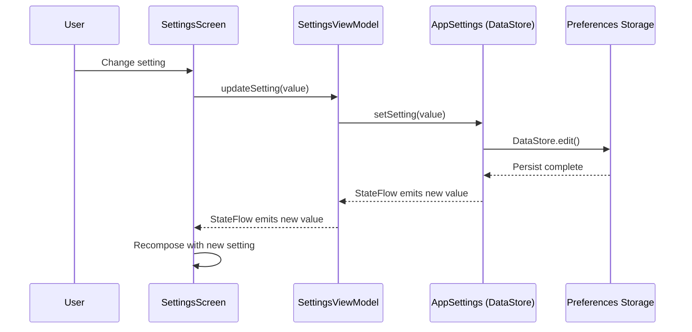

# Data Flow

This document describes how data flows through the Radar application, from GPS signals to UI updates.

## Architecture Diagram

## Location Data Flow

## Route Recording Flow

## Route Following Flow

## StateFlow Architecture

The app uses Kotlin **StateFlow** for reactive state management:

| StateFlow | Type | Description |
|-----------|------|-------------|
| `locationState` | `StateFlow<LocationState>` | Current GPS location, accuracy, satellites |
| `isRecording` | `StateFlow<Boolean>` | Whether route is being recorded |
| `isFollowing` | `StateFlow<Boolean>` | Whether following a saved route |
| `currentRouteId` | `StateFlow<Long?>` | ID of current route (recording or following) |
| `currentRouteName` | `StateFlow<String?>` | Name of current route |
| `currentRoutePoints` | `StateFlow<List<RecordedPointEntity>>` | Points for current route (Room-backed) |
| `followingRemainingPoints` | `StateFlow<List<RecordedPointEntity>>` | Points yet to be reached (in-memory) |

## UI State Flow

## Satellite Data Flow

## Settings Data Flow

