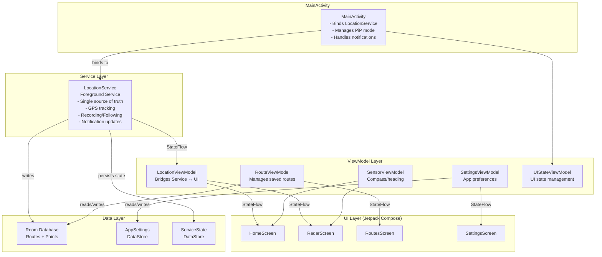

# Architecture Overview

Radar follows the **MVVM (Model-View-ViewModel)** architecture pattern with **Clean Architecture** principles, using **manual dependency injection** via ViewModel factories.

## Overall Architecture

## Layer Responsibilities

### Service Layer (`service/`)
- **LocationService**: Foreground service that manages GPS location updates and route recording
  - Single source of truth for location data
  - Runs as a Foreground Service to survive screen lock
  - Handles route recording and following logic
  - Updates notification with recording/following status
  - Persists state via ServiceState (DataStore) for restarts

### ViewModel Layer (`viewmodel/`)
- **LocationViewModel**: Bridges LocationService and UI, manages location state
- **RouteViewModel**: Manages saved routes list
- **SensorViewModel**: Handles compass/heading via accelerometer and magnetometer
- **SettingsViewModel**: Manages app settings preferences
- **UIStateViewModel**: Manages UI state (navigation destination, PiP mode, pending stop actions)

### Data Layer (`data/`)
- **AppDatabase**: Room database instance (singleton via `getInstance()`)
- **RouteDao**: Data access object for routes and points
- **RouteEntity/RecordedPointEntity**: Database entities
- **AppSettings**: DataStore preferences for user settings
- **ServiceState**: DataStore for persisting service state across restarts

### UI Layer (`ui/`)
- **Screens**: HomeScreen, RadarScreen, RoutesScreen, SettingsScreen
- **Components**: RadarView, CurrentLocationCard, RangeSelector, etc.
- **Theme**: Material 3 theming (colors, typography)

## Dependency Injection

The app uses **manual dependency injection** via ViewModel factories (`viewModels()`). Key components:

- `AppDatabase.getInstance(context)` - Room database singleton
- `RouteDao` - Injected via database instance
- `AppSettings(context)` - DataStore preferences
- `LocationService` - Bound via ServiceConnection in MainActivity

## Key Design Decisions

1. **Foreground Service**: Location tracking runs as a foreground service to ensure reliability even when the screen is locked or the app is in the background.

2. **StateFlow for State Management**: ViewModels expose `StateFlow` properties that the UI observes. This provides a reactive data flow.

3. **Repository Pattern via DAO**: The RouteDao acts as a repository, providing a clean API for database operations.

4. **Single Source of Truth**: LocationService is the single source of truth for location and recording state, avoiding duplication between ViewModel and Service.

5. **Picture-in-Picture Support**: The app supports PiP mode, allowing users to keep the radar visible while using other apps.

6. **State Persistence**: ServiceState (DataStore) persists recording/following state across service restarts (e.g., system killing the service).